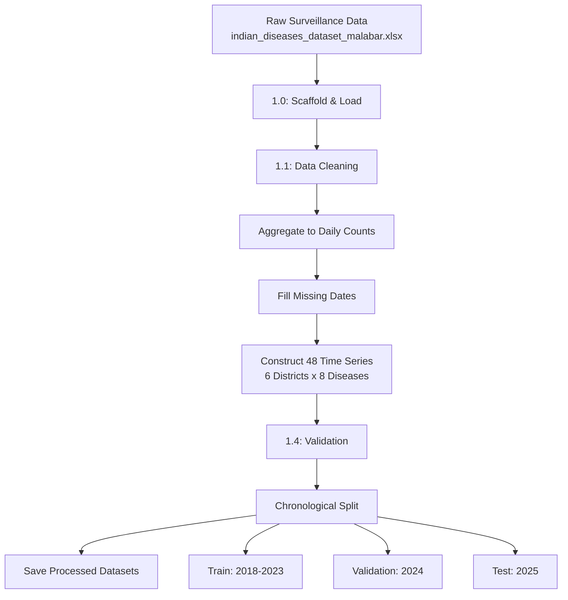

# Stage 1 — Data Preparation & Time Series Construction

## Overview

Stage 1 transforms raw patient-level disease surveillance records into clean, continuous daily time series, structured for statistical anomaly detection in later stages.

---

## Pipeline Flow

---

## Sub-Stages

| Stage | File | Description |
|---|---|---|
| 1.0 | `stage_1_0_scaffold.py` | Loads raw dataset, sets up project folder structure |
| 1.1 | `stage_1_1_data_cleaning.py` | Standardizes district/disease names, parses dates, removes duplicates |
| 1.2 | (embedded in 1.1) | Aggregates patient-level records to daily case counts per (district, disease) |
| 1.3 | (embedded in 1.1) | Fills missing calendar dates with zero-case entries |
| 1.4 | `stage_1_4_validation.py` | Runs integrity checks on the cleaned daily series |

---

## Methods Used

- **Date parsing**: `pd.to_datetime(..., format='mixed', dayfirst=True)` — handles multiple date formats present in raw source files.
- **Name standardization**: Rule-based string normalization map applied to district and disease name fields.
- **Aggregation**: `groupby(['district', 'disease_name', 'diagnosis_date']).size()` to convert patient-level rows into daily case counts.
- **Date-filling**: Each (district, disease) series reindexed against a continuous daily date range, with missing dates filled as zero cases.
- **Chronological split**: Train (2018–2023), Validation (2024), Test (2025) — no shuffling, preserving temporal order.

---

## Dataset Summary

| Property | Value |
|---|---|
| Source | Malabar surveillance dataset |
| Districts | Kannur, Kasaragod, Kozhikode, Malappuram, Palakkad, Wayanad |
| Diseases | Chickenpox, Chikungunya, Common Cold, Dengue, Flu, Malaria, Typhoid, Viral Fever |
| Time range | 2018-01-01 to 2025-12-28 |
| Total series | 48 (6 districts × 8 diseases) |
| Total rows | 134,808 (train: 105,168 / val: 12,264 / test: 17,376) |

---

## Validation Checks Performed (Stage 1.4)

- Continuous daily index per (district, disease) pair — no gaps.
- No duplicate dates within any series.
- No negative case counts.
- No missing values across required columns.

---

## Outputs

| File | Description |
|---|---|
| `data/processed/train_timeseries.pkl` | 2018–2023 daily series |
| `data/processed/validation_timeseries.pkl` | 2024 daily series |
| `data/processed/test_timeseries.pkl` | 2025 daily series |

---

## Summary

Stage 1 produces 48 clean, continuous daily time series — one per district-disease combination — split chronologically into train/validation/test sets, ready for statistical feature computation in Stage 2.
