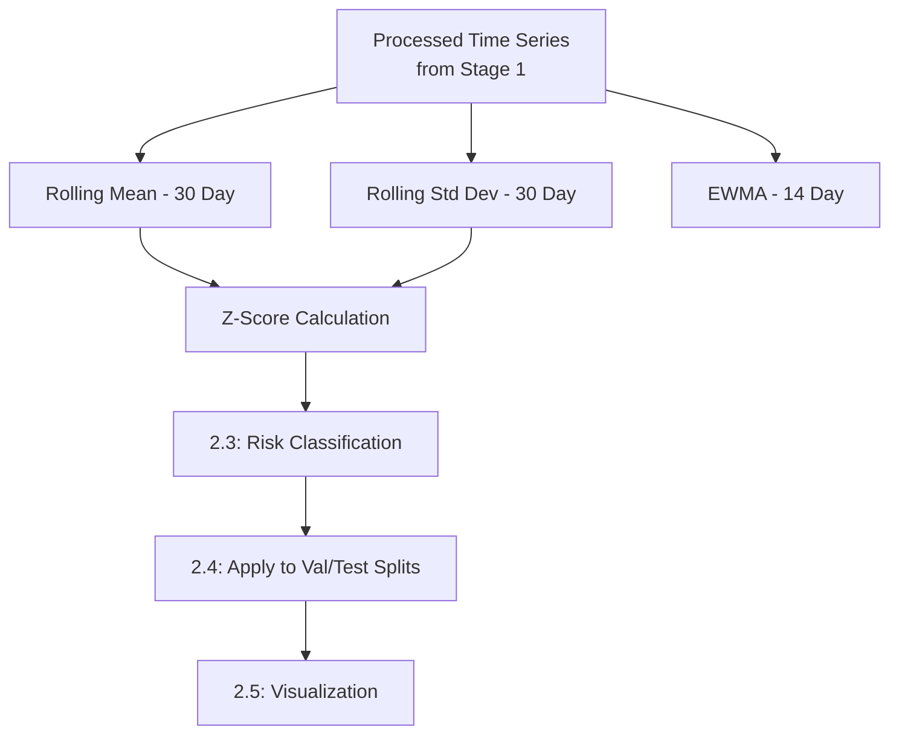
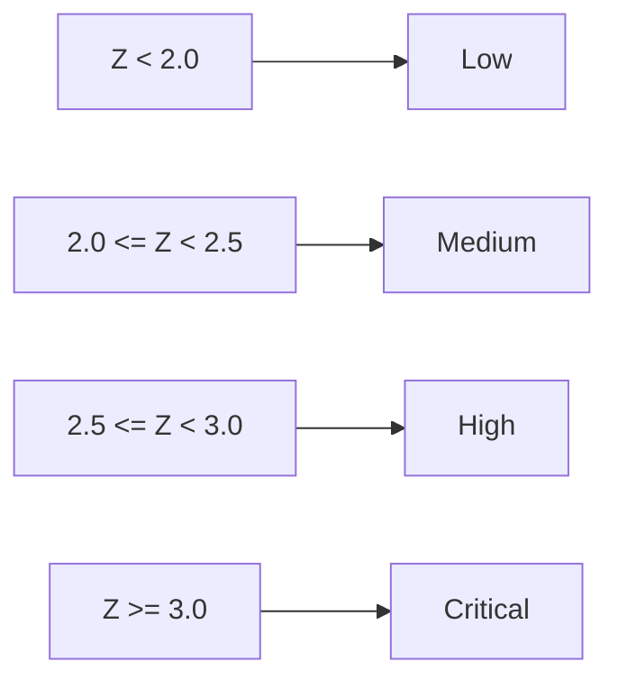

# Stage 2 — Statistical Feature Engineering & Risk Classification

## Overview

Stage 2 computes the statistical baseline features used for anomaly detection — rolling mean, rolling standard deviation, EWMA, and Z-score — and applies a risk classification scheme to each daily observation.

---

## Pipeline Flow

---

## Sub-Stages

| Stage | File | Description |
|---|---|---|
| 2.1–2.2 | (feature engineering) | Computes rolling mean, rolling std, EWMA per series |
| 2.3 | `stage_2_3_risk_classification.py` | Maps Z-score to a four-level risk category |
| 2.4 | `stage_2_4_apply_detection_val_test.py` | Applies all statistical features to validation and test splits |
| 2.5 | `stage_2_5_visualization.py` | Generates exploratory plots — Z-score time series, risk heatmaps |

---

## Statistical Features

| Feature | Method | Purpose |
|---|---|---|
| Rolling Mean (30-day) | `rolling(30).mean()` | Historical baseline for expected case counts |
| Rolling Std Dev (30-day) | `rolling(30).std()` | Baseline variability, used as Z-score denominator |
| EWMA (14-day) | `ewm(span=14).mean()` | Recency-weighted trend signal |
| Rolling Z-Score | `(recent - baseline_mean) / baseline_std` | Core anomaly signal |

---

## Risk Classification Thresholds

| Z-Score Range | Risk Level | Statistical Basis |
|---|---|---|
| Z < 2.0 | Low | Below ~97.7th percentile |
| 2.0 ≤ Z < 2.5 | Medium | Elevated deviation |
| 2.5 ≤ Z < 3.0 | High | Strong deviation |
| Z ≥ 3.0 | Critical | ~99.9th percentile |

---

## Outputs

| File | Description |
|---|---|
| `data/processed/test_detection_results.pkl` | Full statistical feature set + risk level per row (district, disease, date, case_count, rolling_mean_30, rolling_std_30, ewma_14, rolling_z_score, risk_level, tier) |
| `reports/figures/*.png` | Exploratory time series and heatmap visualizations |

---

## Summary

Stage 2 establishes the statistical foundation of the system — a per-series historical baseline (rolling mean/std, EWMA) and a Z-score-derived risk classification — applied consistently across the validation and test periods, feeding directly into Stage 3's event detection logic.
