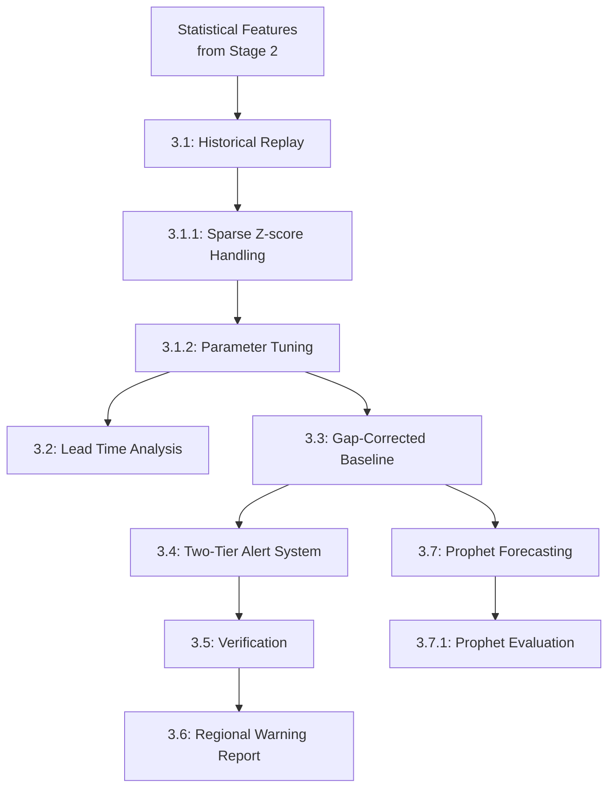
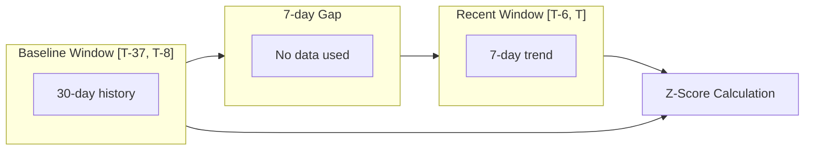
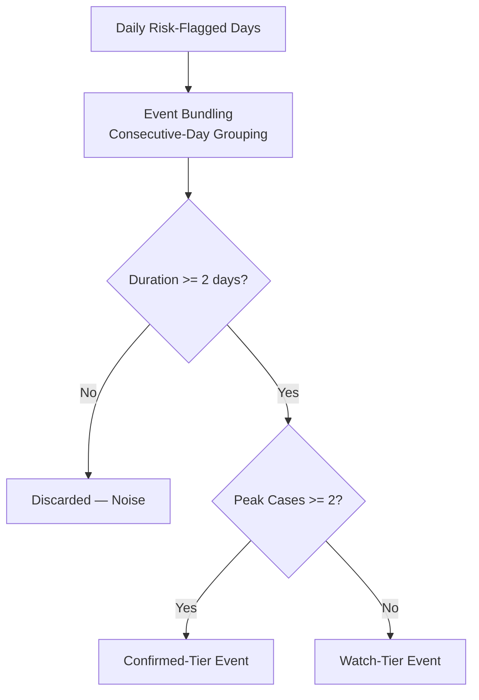

# Stage 3 — Anomaly Detection, Evaluation & Forecasting

## Overview

Stage 3 builds the operational detection engine on top of Stage 2's statistical features: a gap-corrected baseline, event bundling logic, a two-tier alert classification system, historical replay evaluation, and a supplementary Prophet-based forecasting model.

---

## Pipeline Flow



---

## Sub-Stages

| Stage | File | Description |
|---|---|---|
| 3.1 | `stage_3_1_historical_replay.py` | Simulates day-by-day detection across the training period to build an event catalogue |
| 3.1.1 | `stage_3_1_1_sparse_zscore_fix.py` | Applies an epsilon floor to standard deviation for sparse-count series |
| 3.1.2 | `stage_3_1_2_parameter_tuning.py` | Grid search over `std_floor` and `min_duration` on the validation period |
| 3.2 | `stage_3_2_lead_time_analysis.py` | Measures days between first detection and peak case count per event |
| 3.3 | `stage_3_3_gap_corrected_baseline.py` | Implements a temporal gap between the baseline and recent-trend windows |
| 3.4 | `stage_3_4_two_tier_alerts.py` | Classifies events into Confirmed-Tier and Watch-Tier using duration and peak-case filters |
| 3.5 | (verification) | Runs integrity assertions on the alert output |
| 3.6 | (regional report) | Generates a human-readable Markdown risk snapshot for a given week |
| 3.7 | `stage_3_7_prophet_forecast.py` | Trains a Prophet forecasting model on a flagship series |
| 3.7.1 | `stage_3_7_1_prophet_evaluation.py` | Evaluates Prophet accuracy, calibration, and cross-validation performance |

---

## Core Detection Algorithm

**Gap-corrected Z-score formula:**

```
Baseline window:   days [T-37, T-8]   → 30-day mean and std, ending 7 days before today
Recent window:     days [T-6, T]      → 7-day recent trend

Z(T) = ( mean(cases[T-6:T]) − mean(cases[T-37:T-8]) ) / max( std(cases[T-37:T-8]), epsilon )
```



---

## Two-Tier Alert Classification



| Filter | Threshold | Purpose |
|---|---|---|
| Minimum duration | ≥ 2 consecutive days | Distinguishes sustained anomalies from single-day noise |
| Minimum peak cases | ≥ 2 cases (Confirmed) / < 2 (Watch) | Distinguishes case-supported anomalies from sparse-series statistical artifacts |

---

## Key Parameters

| Parameter | Value |
|---|---|
| Baseline rolling window | 30 days |
| Baseline gap (shift) | 8 days |
| Recent trend window | 7 days |
| EWMA span | 14 days |
| Std floor (epsilon) | 1e-6 |
| min_duration | 2 days |
| min_peak_cases | 2 |
| min_periods (rolling) | 15 days |
| Z-score threshold — Medium | 2.0σ |
| Z-score threshold — High | 2.5σ |
| Z-score threshold — Critical | 3.0σ |

---

## Prophet Forecasting Model

**Target series:** Palakkad – Chikungunya

**Model:** Facebook Prophet, additive decomposition:
```
y(t) = trend(t) + yearly_seasonality(t) + weekly_seasonality(t) + error(t)
```

| Setting | Value |
|---|---|
| Yearly seasonality | Enabled |
| Weekly seasonality | Enabled |
| Daily seasonality | Disabled |
| Interval width | 0.95 (95% CI) |
| Changepoint prior scale | 0.05 |
| Train period | 2018–2024 |
| Test period | 2025 |

**Anomaly rule:** flag a day where `actual > yhat_upper`.

---

## Evaluation Results

### Historical Replay & Tuning

| Metric | Value |
|---|---|
| Full-history events (pre-filter) | 1,192 |
| Final Confirmed-Tier events (2025 test) | 4 |
| Final Watch-Tier events (2025 test) | 25 |
| Total events (2025 test) | 29 |
| Max Z-score (gap-corrected) | ~2.95–3.12 |

### Lead Time Analysis

| Metric | Value |
|---|---|
| Average lead time | 0.94 days |
| Median lead time | 1.0 day |
| Range | 0–2 days |

### Prophet Accuracy (Palakkad–Chikungunya)

| Metric | Value |
|---|---|
| MAE | 0.184 cases/day |
| RMSE | 0.392 cases/day |
| Coverage (95% CI) | 90.6% |
| Naive baseline MAE | 0.203 |
| Improvement over naive baseline | 9.4% |
| Cross-validation avg MAE (30-day horizon) | 0.261 |

---

## Outputs

| File | Description |
|---|---|
| `reports/historical_replay_events.csv` | Full event catalogue from replay simulation |
| `reports/historical_replay_summary.json` | Summary statistics |
| `reports/lead_time_summary.json` | Lead time analysis results |
| `reports/two_tier_alerts_2025.csv` | Final Confirmed/Watch event table |
| `reports/regional_warning_snapshot_2025-12-18.md` | Weekly regional warning report |
| `models/prophet_palakkad_chikungunya.pkl` | Trained Prophet model |
| `reports/prophet_predictions_palakkad_chikungunya.csv` | Prophet forecast output |
| `reports/prophet_accuracy_report.json` | Prophet evaluation metrics |

---

## Summary

Stage 3 implements the complete detection pipeline: a gap-corrected statistical Z-score engine, a two-tier alert classification system distinguishing high-confidence "Confirmed" events from broader "Watch" signals, a full-year historical replay for evaluation, and a supplementary Prophet forecasting model trained on the region's clearest seasonal disease pattern.
