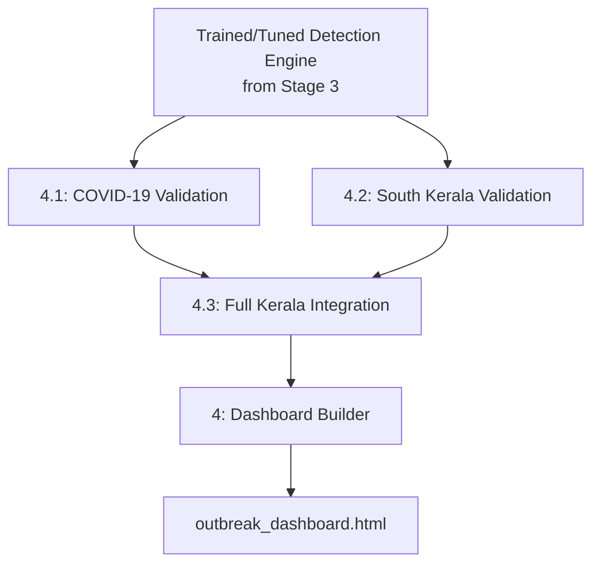
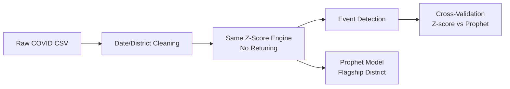
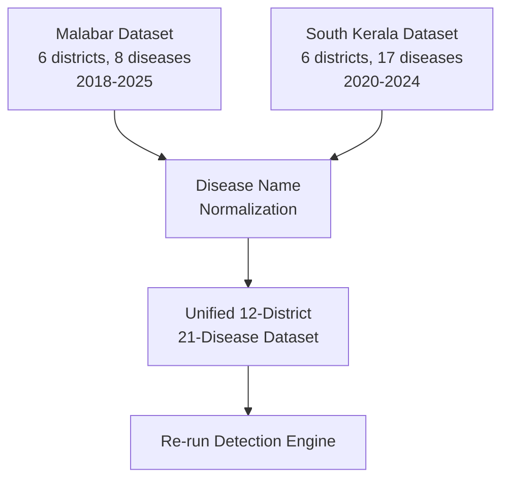
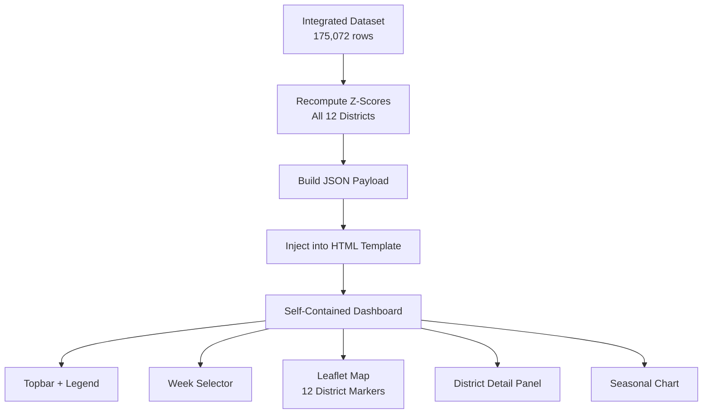

# Stage 4 — Independent Validation, Regional Integration & Dashboard

## Overview

Stage 4 tests the detection pipeline's generalization on independent, previously-unseen datasets, integrates North and South Kerala regions into a unified dataset, and builds the final interactive dashboard.

---

## Pipeline Flow

---

## Sub-Stages

| Stage | File | Description |
|---|---|---|
| 4.1 | `stage_4_1_covid_validation.py` | Runs the full detection pipeline on an independent COVID-19 dataset |
| 4.2 | `stage_4_2_south_kerala_validation.py` | Runs the pipeline on synthetic South Kerala patient records |
| 4.3 | `stage_4_3_kerala_integration.py` | Merges Malabar and South Kerala data into a single 12-district dataset |
| 4 (final) | `stage_4_dashboard.py` | Builds the self-contained interactive HTML dashboard |

---

## 4.1 — COVID-19 Independent Validation

**Purpose:** Test whether the detection pipeline generalizes to a disease and dataset it was never tuned on, without any parameter retuning.

| Property | Value |
|---|---|
| Source | `data/raw/raw1/kerala_district_covid_combined.csv` |
| Time range | 2020-03 to 2021 |
| Districts | Filtered to the 6 Malabar districts |
| Disease | COVID-19 |

**Process:**

**Results:**

| Metric | Value |
|---|---|
| Z-score events detected | 71 |
| Flagship district (Prophet) | Kozhikode |
| Prophet MAE (COVID series) | 475.35 cases/day |
| Prophet–Z-score overlap | 18 days |

---

## 4.2 — South Kerala Validation

**Purpose:** Apply the pipeline to a second, independently structured dataset covering a different Kerala region.

| Property | Value |
|---|---|
| Source | `data/raw/raw1/south_kerala_synthetic_patients.xlsx` |
| Districts | Alappuzha, Idukki, Kollam, Kottayam, Pathanamthitta, Thiruvananthapuram |
| Diseases | 17 diseases, including Leptospirosis, Dengue Fever, Influenza, Scrub Typhus |
| Time range | 2020-01-04 to 2024-12-31 |
| Records | 7,487 patient-level rows, aggregated to ~52,528 daily district-disease rows |

**Results:**

| Metric | Value |
|---|---|
| Events detected | 37 (15 Confirmed-Tier, 22 Watch-Tier) |
| Most flagged disease | Leptospirosis (14 events) |

---

## 4.3 — Full Kerala Integration

**Purpose:** Combine North (Malabar) and South Kerala datasets into a single, unified 12-district surveillance system.

**Disease name normalization applied:**
- `Dengue Fever` → `Dengue`
- `Flu` → `Influenza`
- `Chicken Pox` → `Chickenpox`

**Results:**

| Metric | Value |
|---|---|
| Combined rows | 175,072 |
| Districts | 12 |
| Diseases | 21 |
| Date span | 2018-01-01 to 2025-12-28 |
| Total events | 220 (61 Confirmed-Tier, 159 Watch-Tier) |
| North Kerala events | 183 |
| South Kerala events | 37 |
| Most flagged disease | Influenza (34 events) |

---

## Dashboard

**File:** `outputs/outbreak_dashboard.html` — self-contained, no backend dependencies.

### Dashboard Features

| Component | Description |
|---|---|
| Topbar | Title, region tags, color legend (Red=Emergency, Amber=Watch, Green=Normal, Blue-dashed=Seasonal Watch) |
| Week selector | Dropdown covering all 52 weeks of 2025 |
| Stats pills | Live counts of Emergency / Watch / Normal districts |
| Interactive map | Leaflet.js + OpenStreetMap, 12 district markers, color-coded by risk tier |
| Detail panel | District status, triggering disease, case count, recommended action, full disease breakdown table |
| Seasonal chart | Prophet forecast (Palakkad) or historical monthly averages (other districts) |
| Disclaimer | Statistical-advisory caveat |

### Map Legend

| Color | Meaning |
|---|---|
| Red | Emergency (Confirmed-Tier active) |
| Amber | Watch / Advisory |
| Green | Normal |
| Blue dashed outline | AI Seasonal Watch (Prophet-driven) |

---

## Outputs

| File | Description |
|---|---|
| `reports/covid_validation/` | COVID-19 validation events, predictions, summary |
| `reports/south_kerala_validation/` | South Kerala validation events, summary |
| `reports/kerala_integrated/kerala_integrated_summary.json` | Full 12-district integration summary |
| `outputs/outbreak_dashboard.html` | Final interactive dashboard |

---

## Summary

Stage 4 validates the detection pipeline's generalization across two independent datasets (COVID-19, South Kerala), integrates the full Kerala region into a unified 12-district, 21-disease system, and delivers a self-contained interactive dashboard combining the detection engine's outputs, weekly regional warnings, and seasonal forecasting into a single map-based interface.
